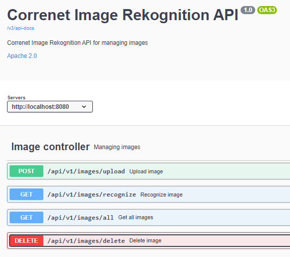
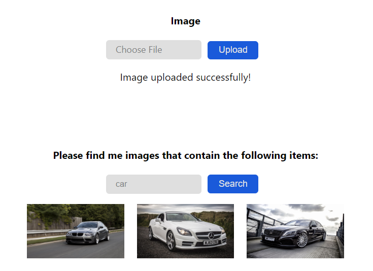

# Correnet Image Rekognition API

## 📌 Description
This web application is a RESTful API that provides image recognition service. 
It allows users to upload images to S3 bucket and get the images based on the provided items.

## 📌 Technologies
* Java 17
* Spring Boot (Web)
* AWS (S3, Rekognition, Secrets Manager)
* Maven
* Lombok
* JUnit/Mockito

## 📌 API-Documentation
Project has [OpenApi](http://localhost:8080/swagger-ui/index.html) documentation



## 📌 Tests-Coverage
Application has more than +80% test coverage using JUnit and Mockito

## 📌 Quickstart
1. Fork this repository
2. Open project in your favorite IDE
3. Run project (you even don't need to configure any AWS credentials in ```application.properties```, because all the secrets are stored in AWS Secrets Manager)
4. Open [Swagger](http://localhost:8080/swagger-ui/index.html) to see the API documentation
5. Enjoy it!

## 📌 FrondEnd
This project has a frontend part written in React. You can find it [here](https://github.com/AndrewHudzenko/image-rekognition-frontend)

